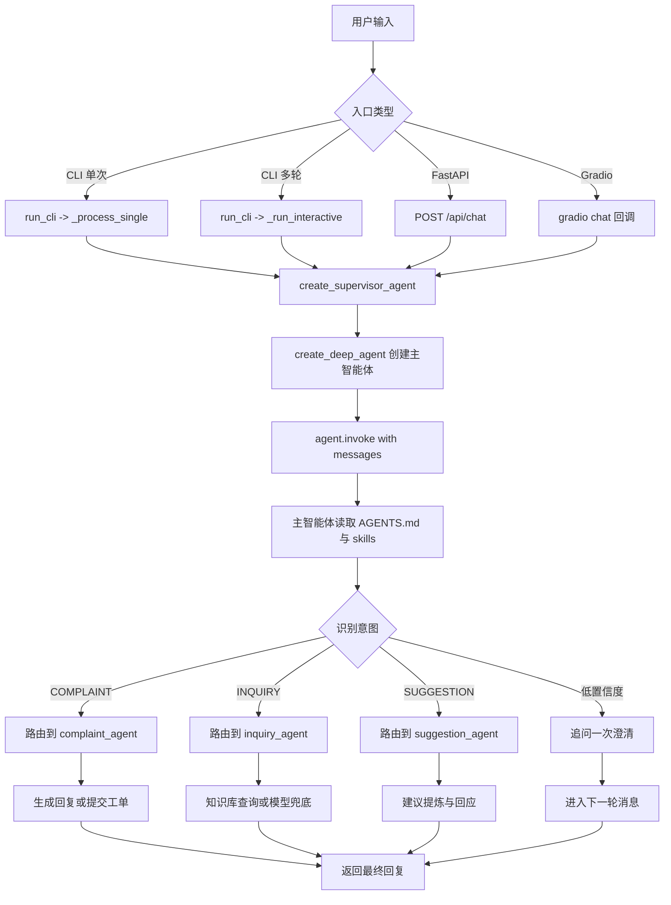
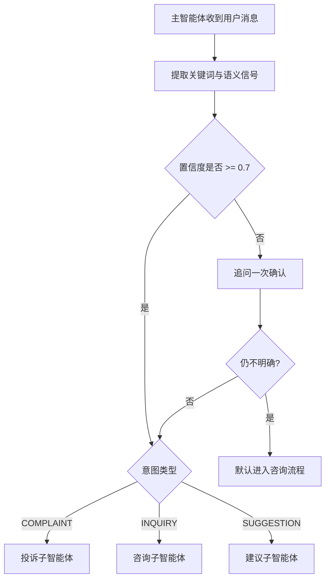
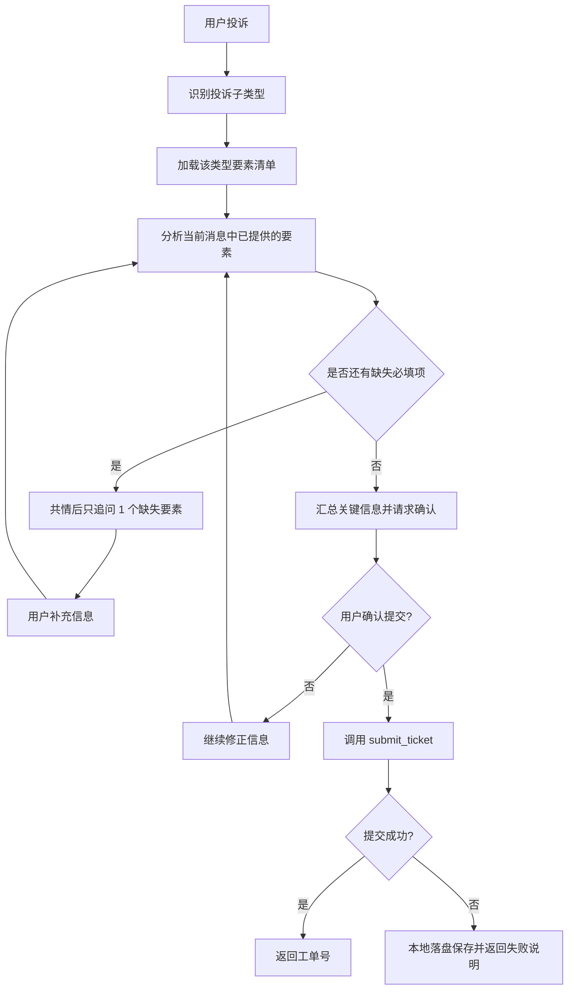
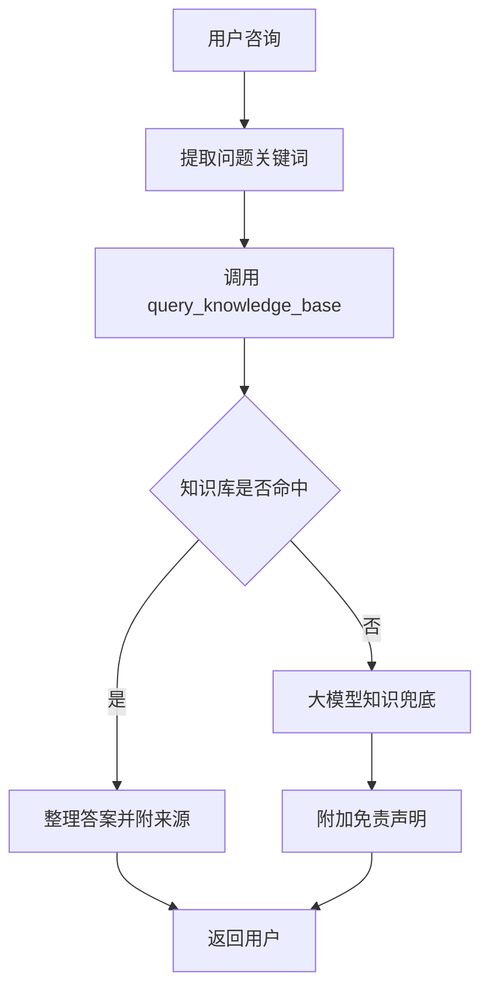
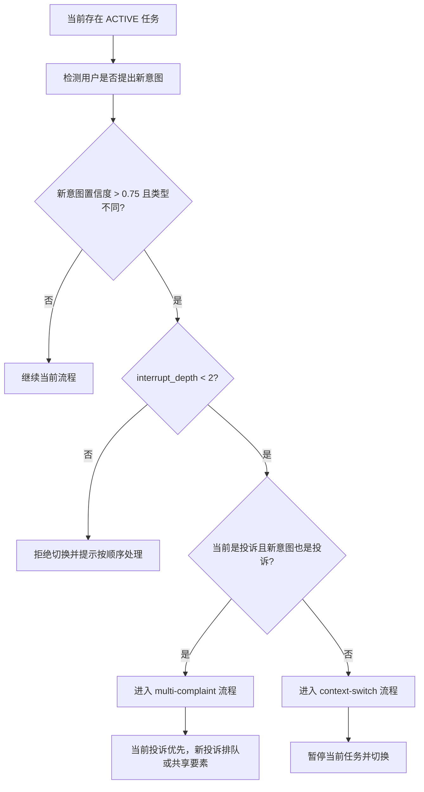
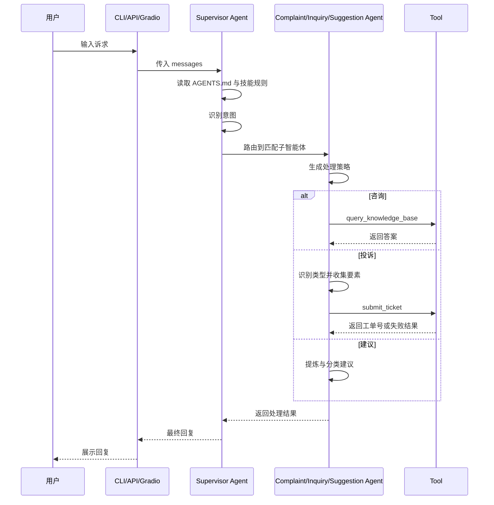

# 12345 热线智能客服工程流程说明

本文档基于当前工程代码、`AGENTS.md` 规则文件、各子智能体提示词与技能配置整理，说明系统从入口接收用户消息，到主智能体路由，再到投诉、咨询、建议处理的整体流程。

## 1. 工程目标

该工程实现了一个 12345 政务服务热线智能客服主智能体，负责完成三类任务：

- 投诉类诉求的识别、要素收集与工单提交
- 咨询类诉求的知识库查询与兜底回答
- 建议类诉求的提炼、分类与记录回应

系统当前提供三种入口：

- CLI 单次调用
- CLI 多轮对话
- FastAPI `/api/chat`
- Gradio Web 对话界面

## 2. 核心组件

### 2.1 主智能体

主智能体由 `create_supervisor_agent()` 创建，职责是：

- 读取根目录 `AGENTS.md` 作为记忆与总规则
- 加载意图分类、兜底处理、上下文切换、多投诉处理等技能
- 根据用户输入将任务路由到投诉、咨询、建议子智能体

### 2.2 子智能体

系统定义了三个业务子智能体：

- `complaint_agent`：处理投诉、收集要素、提交工单
- `inquiry_agent`：处理政策与流程咨询，优先调用知识库
- `suggestion_agent`：处理建议，做摘要与温和回应

代码中还预留了 `element_extraction_agent` 规格，用于投诉要素完整度分析；从工程结构看，这是投诉流程中的辅助分析角色。

### 2.3 工具层

当前项目注册了两个主要工具：

- `query_knowledge_base`：查询政务知识库，支持 mock 数据
- `submit_ticket`：提交投诉工单，支持 mock 落盘到 `sessions/`

### 2.4 会话状态层

`tools/session_store.py` 提供多任务栈管理能力，用于支持：

- 咨询插入投诉时的暂停与恢复
- 投诉中再次出现新投诉时的排队处理
- `interrupt_depth` 守卫

从当前代码实现看，主会话历史主要保存在内存列表中，任务栈能力已经具备，但尚未在 `main.py` 中完全串接成显式流程。

## 3. 总体执行流程



## 4. 主智能体路由流程

主智能体是整个工程的调度中心。它先读取根规则，再根据技能完成意图判断。

### 4.1 输入处理

无论来自 CLI、API 还是 Gradio，最终都会构造成统一的消息结构：

```python
{"messages": [{"role": "user", "content": "..."}]}
```

多轮对话模式下，历史消息会持续追加，作为后续轮次的上下文。

### 4.2 意图分类规则

主智能体依据根 `AGENTS.md` 和 `skills/intent-classification` 中的规则进行三分类：

- 包含“投诉、举报、不满、损坏、停水、停电”等词，倾向 `COMPLAINT`
- 包含“怎么办、如何、流程、政策、查询”等词，倾向 `INQUIRY`
- 包含“建议、希望、改进、能不能”等词，倾向 `SUGGESTION`

如果分类置信度不足，则最多追问一次。仍不明确时，规则要求默认进入咨询流程。



## 5. 投诉处理流程

投诉流程是系统最复杂的部分。其目标不是一次性回答，而是逐轮收集必填要素，最后调用工单工具提交。

### 5.1 处理目标

投诉子智能体需要完成以下任务：

- 识别投诉子类型
- 尽量从用户原话中提取已提供信息
- 每轮只追问一个缺失要素
- 全部必填要素收集完成后确认并提交

### 5.2 投诉子类型

当前规则支持：

- `WATER_OUTAGE`
- `POWER_OUTAGE`
- `NOISE_COMPLAINT`
- `ROAD_DAMAGE`
- `GAS_ISSUE`
- `OTHER`

### 5.3 要素清单

`data/complaint_schemas.json` 作为投诉类型到要素清单的配置来源，在技能规则里用于：

- 根据投诉内容映射投诉类型
- 加载该类型的 `required_elements`
- 决定下一轮应追问哪个字段

需要说明的是：当前工程代码中尚未看到显式的 Python 读取逻辑，现阶段主要由技能与提示词层消费这份配置。

### 5.4 工单流程图



## 6. 咨询处理流程

咨询子智能体优先调用知识库工具，不直接承诺最终办理结果。

实际处理逻辑如下：

- 提炼咨询关键词
- 调用 `query_knowledge_base`
- 若知识库命中，则整理答案并附来源
- 若未命中或超时，则使用模型知识兜底，并附“以官方最新规定为准”声明



## 7. 建议处理流程

建议子智能体处理相对简单，重点是礼貌、提炼与不承诺。

主要步骤：

- 感谢用户提出建议
- 提炼建议要点
- 做主题分类
- 返回积极、克制的回应

如果建议内容实际上更像投诉或咨询，规则允许将其纠正并转入对应流程。

## 8. 中途切换与多任务管理

工程规则中定义了会话内任务切换机制，这部分由根 `AGENTS.md`、`context-switch` skill 和 `SessionStackManager` 共同支持。

### 8.1 咨询插入投诉

当当前任务不是投诉，用户中途提出高置信度投诉时：

- 暂停当前任务
- 保存当前任务上下文
- 切换到投诉流程
- 投诉完成后恢复之前任务

### 8.2 投诉中新增投诉

当当前已在处理投诉，用户又提出新的投诉时：

- 若与当前投诉关联度高，可共享部分要素
- 若独立，则进入 `PENDING` 队列
- 先完成当前投诉，再恢复排队投诉

### 8.3 interrupt_depth 守卫

为避免无限嵌套切换，系统设置：

- `interrupt_depth < 2`：允许切换
- `interrupt_depth >= 2`：拒绝继续切换，引导用户先完成当前问题



## 9. 工程中的实际落地情况

从当前仓库代码看，可以将流程分成“已直接落地”和“规则已定义但串接仍待加强”两部分。

### 9.1 已直接落地

- 多入口统一汇总到主智能体
- 主智能体通过 `create_deep_agent` 创建
- 咨询、投诉、建议三个子智能体已注册
- 知识库查询工具与工单提交工具可用
- Gradio 与 FastAPI 均支持多轮会话

### 9.2 已有规则但仍偏提示词驱动

- `complaint_schemas.json` 目前主要由技能规则使用
- `element_extraction_agent` 已定义规格，但未在主流程代码中直接实例化
- `SessionStackManager` 已实现，但未在 `main.py` 中显式接入
- 上下文切换和多投诉能力更多依赖 Deep Agent 提示词与技能执行

## 10. 一次典型请求的时序示意



## 11. 总结

当前工程已经形成了“主智能体调度 + 三类业务子智能体 + 工具层 + 会话状态层”的完整骨架。

如果从工程成熟度看：

- 用户入口、主路由和基础工具已经具备
- 投诉要素清单、任务切换和多投诉策略已经有较完整的规则设计
- 下一步若要增强可控性，应将投诉要素校验、任务栈切换、要素提取等逻辑从提示词层进一步下沉到显式 Python 代码中

